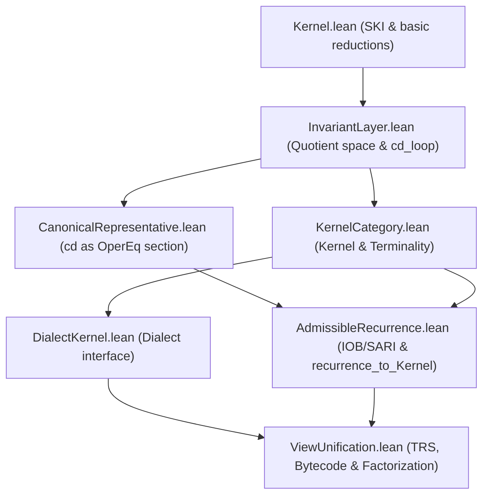

# ISAR Proof Status & Dependency Index

This document provides a comprehensive inventory of proof dependencies, first-principles derivations, and foundational definitions/axioms across the ISAR verified stack.

---

## Program status (2026-08-16)

Build: `lake build ISAR` green. No `sorry` / `sorryAx` in `src/**/*.lean`.

The formal core now has: confluence and unique NFs; `cd` as a **normalizing strategy** on `HasNF` (`finite_cd_reaches_NF_iff`); online Jones–Gomard–Sestoft PE for the whole `IStep` signature (`JGS_PE`) plus the **Jones-optimality** cost criterion (`JonesOptimal`; toy `JonesIdPE` positive, `JGS_PE` / `TrivialPE` negative); a tensor **term model**; constructed HF Ackermann / ISK Gödel numbering; constructed `layerToNat` (min-Gödel enumeration); `R_empty` / `I_true` on the OperEq quotient; holonomic closure theorems with one named analytic axiom.

### Done (residue cycle)

| Item | Where | Honest claim |
| :--- | :--- | :--- |
| 1 Ship | `1d538c5` on `origin/master` | Previous six-step cycle already shipped. No Lean in this item. |
| 2 Jones-optimality | `Futamura.lean` | `JonesOptimal` on `PESetup` (`SelfInterpreter` + `pe_cost` bound). `¬ JonesOptimal TrivialPE`; `¬ JonesOptimal JGS_PE` (no self-interpreter). Toy `JonesIdPE` is Jones-optimal. **Not** 1993 polyvariant mix / cogen; `specTerm` is still `swap`. |
| 3 UAT / metric freeze | `ISARApproximation.lean` | Freeze **is** the decision, not a placeholder. No metric invented. `ISAR_UAT` stays named. Next wiring is `Metric.Completion` **only after** a metric exists. |
| 4 SARI `R` empty | `AdmissibleRecurrence.lean` | Theorems `R_empty` / `I_true` from `step_same_quotient` + `q1 ≠ q2`. Kernel half of `recurrence_to_Kernel` unchanged. Remaining softness is empty `R`; nonempty dynamics need a relation not already collapsed by joinability. |
| 5 `HasNF` AC | `InvariantLayer.lean` / `CanonicalRepresentative.lean` | Computational HasNF section is `nf_of_HasNF_fuel`. `nf_of_term` remains the AC section used by `canonical_rep`. `¬HasNF` is expected (SKI is not SN), not a gap. Not claimed computable. |
| 6 Named leftovers | `QuantityKernel.lean` / `HolonomicCompose.lean` | Four `quantityToNat` axioms stay named. Optional constructed `QuantityCore` (no `String`/`Float`) is encodable. `exp_exp_not_holonomic` stays named (no fake Stanley/Bell proof). |

### Named axioms that stay named

| Item | Why it is not a theorem |
| :--- | :--- |
| `quantityToNat` / `natQuantity` | Full `Quantity` carries `String` / `Float`, which block `Encodable`. `QuantityCore` is a separate encodable fragment. |
| `exp_exp_not_holonomic` | Stanley/Bell analytic fact; not in Mathlib. |
| `ISAR_UAT` and completion/embedding axioms | Frozen named: freeze is the decision. No metric on `KernelAddress` (compact-open `C(ℝᵈ,ℝᵏ)`, not a global sup metric). Next wiring is `Metric.Completion` only after a metric exists. `ISAR_UAT` stays named. |

### Where to go next (priority order)

1. **1993 polyvariant mix / cogen product** — still open as *full* mix. **CoGen + FasmRealize landed:** `host/cogen.py` choose/emit; IdentityRealize + FasmRealize; `host/fasm_dialect.py`; Lean `CoGen` / `FASMView`. Do not stretch `JGS_PE` into a compiler-generator. Native fasmg/CPU loaders are **next** (decision 011) — not required for Phase 4b.
2. **Mine-adopt** — `try_adopt`: OperEq match a known QuotientMap (identity / bytecode / fasm) or refuse (explicit map required).
3. **Nonempty SARI dynamics** — `R_empty` is a theorem. A nonempty `R` needs a relation that is *not* already collapsed by `OperationalEq` / joinability. Do not change `OperationalEq` to fake a step.
4. **Metric, then completion** — UAT freeze is the decision. Do not claim `ISAR_UAT` proved or restate `KernelAddressLimit` as `Metric.Completion` before a metric exists.
5. **Keep named** — `quantityToNat` (full `Quantity`) and `exp_exp_not_holonomic`. `QuantityCore` does not replace the four axioms.
6. **Pure tower / `IStepCore`** — L0 = norm/app/comp/dup/swap. **S:** recovered (`derived_s_beta`) under BCWI — correct. **K:** L1 fused macro only (`IStep.konst_macro` / `IStepKMacro`); `IStepBasis = IStepCore ∪ IStepKMacro`. **BCWI ⊬ K in all respects** — do not derive, demote-into-BCWI, or “recover” K from that basis. **BCWIK was construction scaffolding** (so ISAR could be proved at all), not a claim that K is BCWI-definable. Complete CL basis remains BCKW. `derived_k_signature` is IRAS word evidence for the macro tag, not a β-from-BCWI theorem.

**Phase 3 (observation category) landed:** Lean `ObservationRegime` / `QuotientMapO` / `operEqRegime`; host mirrors; maps preserve \(\mathcal O\).

**Phase 4a (CoGen machinery) landed:** choose/emit/adopt + IdentityRealize under \(\mathcal O\) + `MachineContext`.

**Phase 4b (FASM QuotientMap + FasmRealize) landed:** fasmg-ish presentation QuotientMap sharing Bytecode VM; CoGen family=`fasm` piece (`kind=fasm`, reduce=`graph.lo`). No external fasmg. Bootstrap = truthful *representation* — never InvariantLayer “IT”. EAL / IC = \(R_{c,\mathcal O}\) only.

Do **not**: claim 1993 mix; treat `¬HasNF`/no-fuel as a gap; claim `nf_of_term` computable; repair the withdrawn quine whitepaper; invent a metric this cycle.

### Step log

| Step | Status | Notes |
| :--- | :--- | :--- |
| 1 JGS increment | PASS | `bta` lemmas + monovariant `offline_spec`; extra `compβ` Nontrivial witness. **1993 polyvariant mix still open.** |
| 2 HasNF section | PASS | `nf_of_HasNF_fuel` / `nf_of_HasNF` (choose fuel, then `cd_loop_fuel`). `nf_of_term` still AC on `¬HasNF`. Not claimed computable. |
| 3 Kernel false-variant | PASS | `DegenerateKernel` + `no_indiscrete_Kernel`. Terminality still holds; not a disproof. |
| 4 SARI honesty | PASS | STATUS §4 matches live code; `I` := no outgoing `R`; `fixed_point` is `Iff.rfl`. Kernel morphisms unchanged. `R` empty (`step_same_quotient`). |
| 5 Approximation stack | PASS | Frozen named axioms; no metric on `KernelAddress`. `ISAR_UAT` stays named. Next wiring is `Metric.Completion` only. |
| 6 layerToNat | PASS | Min-Gödel enumeration bijection; four axioms deleted. `layerToNat_godelClass_three_ne` blocks raw-code `rfl`. Still `noncomputable`. |

Six-step cycle closed 2026-08-14: all PASS. Shipped as `1d538c5`. Blueprint follow-up (2026-08-15): `ISAR.SpecializerCorrect` replaced by `ISAR.PESetup`; Paper C no longer claims a constructed metric.

| Residue | Status | Notes |
| :--- | :--- | :--- |
| 1 Ship | PASS | `1d538c5` on `origin/master`. |
| 2 Jones-optimality | PASS | Criterion landed; `JonesIdPE` positive; `TrivialPE` / `JGS_PE` negative. **1993 cogen still open.** |
| 3 UAT freeze | PASS | Freeze is the decision. `ISAR_UAT` not proved. |
| 4 `R_empty` / `I_true` | PASS | From `step_same_quotient` + `q1 ≠ q2`. Kernel morphisms unchanged. |
| 5 `HasNF` AC docs | PASS | `nf_of_HasNF_fuel` computational; `nf_of_term` AC; `¬HasNF` expected. |
| 6 Named leftovers | PASS | `quantityToNat` + `exp_exp_not_holonomic` stay named; `QuantityCore` constructed. |

Residue cycle closed 2026-08-16: all PASS. Remaining named: `quantityToNat`, `exp_exp_not_holonomic`, `ISAR_UAT` + completion axioms.

---

## Inventory: `sorry` / `axiom` / `noncomputable`

Build: `lake build ISAR` green. No `sorry` / `sorryAx` in `src/**/*.lean`.

Honest JGS claim: `JGS_PE` is **online** PE covering every `IStep` constructor (`normβ`/`konstβ`/`compβ`/`sβ`). Monovariant `bta` now has lemmas (`bta_eq_dynamic_iff_containsSwap`, static atom independence, `offline_spec` fold equations). Jones-optimality criterion landed (`JonesOptimal`; `JonesIdPE` positive; `¬ JonesOptimal JGS_PE` / `TrivialPE`). Jones–Gomard–Sestoft 1993 **polyvariant offline mix / compiler-generator** remains **open** (not claimed). `specTerm` is still `swap`, not an encoding of `jgs_spec`.

### Sorry

| Item | Status | Notes |
| :--- | :--- | :--- |
| *(none)* | **OK** | Comments only say “sorry-free”; no `sorry` tactics. |

### Axioms (classified)

| Location | Item | Status | Notes |
| :--- | :--- | :--- | :--- |
| `HFSet.lean` | `testBit_zero_number`, `testBit_shiftl` | **fixed → theorems** | Now `Nat.zero_testBit` / `testBit_two_pow` proofs. |
| `IotaView.lean` | `iota_encode_decode_canonical` | **fixed → removed** | Was a false-risk “NF stays in ι-image” claim. Dialect now observes `InvariantLayer` (computable `id` decode). |
| `HolonomicCompose.lean` | `exp_exp_not_holonomic` | **OK** | Named Stanley/Bell analytic fact; not in Mathlib. |
| `HFSetEncoding.lean` | `fromNat` / `toNat` / `subToNat` / `natToSub` | **constructed** | Ackermann coding + ISK Gödel numbering (`Nat.pair`). `toNat_fromNat` is a theorem; `fromNat_toNat_ext` is `ExtEq`. |
| `HFSetEncoding.lean` | `layerToNat` / `natToLayer` (+ inverses) | **constructed** | Min-Gödel enumeration of OperEq classes. `noncomputable`. `layerToNat_godelClass_three_ne`: not `rfl` on raw code 3. |
| `QuantityKernel.lean` | `quantityToNat` / `natQuantity` (+ inverses) | **named** | `Quantity` carries `String`/`Float`, which block `Encodable`. Optional `QuantityCore` is a constructed encodable fragment; it does not replace these axioms. |
| `TensorSemantics.lean` | *(none)* | **constructed** | Term model: `TensorSpace := ITerm`, `ExtEq` = `IRed` joinability, B/C/W combinators; β-laws are theorems. |
| `ISARApproximation.lean` | `ISAR_UAT`, limit/embedding/bijection axioms | **named, frozen** | Freeze is the decision. No `MetricSpace` on `KernelAddress`. `ISAR_UAT` is not a theorem. Next wiring: `Metric.Completion` only after a metric exists. |

### Noncomputable (classified)

| Location | Item | Status | Notes |
| :--- | :--- | :--- | :--- |
| `TRSView` / `BytecodeView` / `IotaView` dialects | Dialect defs | **fixed → computable** | OperEq-quotient observations (`Quotient.lift`); no `canonical_rep`. |
| `ViewUnification` | `TRS_`/`Bytecode_AdmissibleDialect`, `isomorphism_unification` | **fixed → computable** | Follow dialects. |
| `BasisCompleteness` | `term_signature`, `term_matrix` | **fixed → computable** | Were unnecessarily marked. |
| `InvariantLayer` | `nf_of_term`, `canonical_rep` | **OK (necessary)** | AC section used by `canonical_rep`: `Classical.choose` on `HasNF` / `Quotient.exists_rep`. Computational HasNF path: `nf_of_HasNF_fuel`. Not claimed computable. `¬HasNF` expected. |
| `AdmissibleRecurrence` | `recurrence_to_Kernel` | **OK (necessary)** | Uses `canonical_rep` section. |
| `HFSetEncoding` / `HFSetSemantics` / `ZFCInterpretation` / `QuantityKernel` | encode/decode/kernels | **OK** | Gödel/Ackermann constructed; `layerToNat` constructed (min-Gödel, `Classical`/`Nat.find`); `quantityToNat` remains named; `QuantityCore` constructed encodable fragment; `canonical_rep` for sections. |
| `ViewUnification` | `encode_from_sig`, `eval_to_nf`, SN dialect bridge | **OK** | `Classical.choose` / WF recursion choice. |
| `Holonomic*.lean` | `noncomputable section` | **OK (necessary)** | Mathlib analysis / `ℝ` / C∞. |
| `ISARApproximation` | continuous maps / realizations | **OK (necessary)** | Topology on `ℝ`. |
| `TensorSemantics` | `denot_ext`, quotients | **OK** | Term-model `denot` is computable; quotient lifts still use choice. |

**Necessity summary:** remaining `noncomputable` is Classical.choice / `exists_rep` for OperEq sections, Mathlib analysis, or axiom-backed bridges — not silent gaps.

---

## Vacuity audit (headline theorems)

Sorry-free compilation does **not** imply non-vacuous content. Checklist for main claims:

| Claim | Status | Notes |
| :--- | :--- | :--- |
| `IRed_confluence` / `isar_fragment_unique_normal_forms` | Substantive | Parallel reduction / complete development; not `rfl`. |
| `morphism_uniqueness` / `ISAR_Kernel_terminal` | Conditional | Unique morphisms into `ISAR_Kernel` **relative to the `Kernel` interface**. False-variant landed: `DegenerateKernel` (junk `Bool` tag ignored by `view_eq`) is still terminal; `no_indiscrete_Kernel` shows `view_eq := True` cannot inhabit `Kernel`. Not a disproof of terminality. |
| `futamura_first` (subst layer) | Substantive but narrow | Mix equation at the meta-level specializer; does not by itself give optimizing PE. |
| `futamura_second` / `futamura_third` (pre-PESetup) | Formulation-sensitive | Honest form needs object-level `specTerm` + `selfApp` + **nontriviality**; trivial specializers satisfy mix alone. |
| `futamura_second` / `futamura_third` (`PESetup`) | Substantive (conditional) | Mix instantiations. `TrivialPE`: mix/selfApp by `rfl`, `¬ Nontrivial`, `¬ JonesOptimal`. `OptimizingPE`: identity/konstβ fragment folds + tagged residual; mix by size induction, `selfApp` by `rfl`, **`Nontrivial` proved** (`norm·konst`). `JGS_PE`: online PE for the full `IStep` signature (`sβ` unfolds once into a tagged residual); `Nontrivial` proved; `¬ JonesOptimal` (no self-interpreter). Toy `JonesIdPE` is Jones-optimal (`norm` copies the source). 1993 polyvariant offline mix remains open. |
| Finite `cd` unique section | Substantive | Unique NF iff `HasNF`. Finite `cd` reaches that NF iff `HasNF` (`finite_cd_reaches_NF_iff`); fuel is parallel-chain length, not `term_size`. `¬HasNF` ⇒ no fuel yields `NormalI`. Linear fragment still supplies explicit `term_size` fuel. |
| HF encoding in `HFSetEncoding` | Constructed | Gödel/Ackermann constructed; `layerToNat` is min-Gödel enumeration (not `canonical_rep`). |
| `recurrence_to_Kernel` | Bridge | No `Quotient.out` on the carrier quotient: lift decode → `InvariantLayer`, then `canonical_rep` / `cd_loop_fuel`. Unrestricted `canonical_rep_eq` is now a **theorem** (`nf_of_term` uses NF or `exists_rep`; never the false `norm` fallback). |
| `fixed_point` in SARI (`I ↔ no R-step`) | Definitional | `I` is defined as no outgoing `R`, so `fixed_point` is `Iff.rfl`. Not derived from `F`. `R_empty` / `I_true` are theorems (`step_same_quotient` + `q1 ≠ q2`). See §4. |

Procedure for re-check after edits: `#print axioms morphism_uniqueness` (and peers) in a Lean session — reject `sorryAx`; expect `Classical.choice` / `propext` until fully constructive sections land.

**Literature posture:** Rutten–Aczel (coalgebras), Abramsky–Ong (applicative bisimilarity), Jones/Gomard/Sestoft (partial evaluation). No Wolfram / quine-substrate framing on the public surface; the quine whitepaper is withdrawn from the homepage.

---

## 0. Holonomic closure algebra (Python + Lean)

| Artifact | Notes |
| :--- | :--- |
| [`scratch/isar_holonomic_closure_algebra.py`](scratch/isar_holonomic_closure_algebra.py) | Exploratory SymPy kernel. Self-test: `python scratch/isar_holonomic_closure_algebra.py`. |
| [`docs/holonomic_closure_and_isar_session.md`](docs/holonomic_closure_and_isar_session.md) | Session record + Lean inventory (§12). |
| [`src/ISAR/Holonomic.lean`](src/ISAR/Holonomic.lean) | Certificate API. |
| [`src/ISAR/HolonomicClosure.lean`](src/ISAR/HolonomicClosure.lean) | Integral / product / sum closure theorems. |
| [`src/ISAR/HolonomicInstances.lean`](src/ISAR/HolonomicInstances.lean) | All Python self-test residual certificates (proved). |
| [`src/ISAR/HolonomicCompose.lean`](src/ISAR/HolonomicCompose.lean) | Composition refusal; sole analytic axiom `exp_exp_not_holonomic`. |

**Water-tight inventory:** every residual-zero claim from the Python self-test (exp, gaussian, product, sum `exp+gaussian`, Fresnel `sin(x²)`, mixed product `sin(x²)·gaussian`, double-integral shift, compose refuse) is a Lean theorem with no `sorry`. The only named axiom in the holonomic stack is `exp_exp_not_holonomic` (Stanley/Bell non-holonomicity of `exp∘exp`, not yet in Mathlib). Build: `lake build ISAR`.

---

## 1. Index of Proof Dependencies

The logical chain of verified Lean 4 files is structured as follows:

* **[Kernel.lean](https://github.com/Cypoe/ISAR-proofs/blob/master/src/ISAR/Kernel.lean)**:
  - Formulates SKI and ITerm (ISAR symbolic core).
  - Proves confluence (`IRed_confluence`) and unique normal forms (`isar_fragment_unique_normal_forms`) via parallel reduction / complete development.
* **[InvariantLayer.lean](https://github.com/Cypoe/ISAR-proofs/blob/master/src/ISAR/InvariantLayer.lean)**:
  - Constructs the quotient `InvariantLayer` modulo `OperEq`.
  - Defines the normalization loop `cd_loop_fuel`.
* **[KernelCategory.lean](https://github.com/Cypoe/ISAR-proofs/blob/master/src/ISAR/KernelCategory.lean)**:
  - Defines the category of semantic kernels (`Kernel` objects, `KernelHom` morphisms).
  - Proves the **ISAR Kernel Terminality Theorem** (`ISAR_Kernel_terminal`) showing all admissible views factor uniquely through `ISAR_Kernel`.
* **[DialectKernel.lean](https://github.com/Cypoe/ISAR-proofs/blob/master/src/ISAR/DialectKernel.lean)**:
  - Formalizes the abstract `Dialect` wrapper.
* **[AdmissibleRecurrence.lean](https://github.com/Cypoe/ISAR-proofs/blob/master/src/ISAR/AdmissibleRecurrence.lean)**:
  - Formalizes the presuppositional `IOB` triad and operational `AdmissibleSARI` quartet (constrained by confluence, fixed-point invariants, and pairing closure).
  - Proves the **Recurrence Lemma** (`recurrence_lemma`) mapping closed carrier quotients to the next scale and verifying that the quotient layer satisfies the constraints.
  - Proves the **Universal Mapping Theorem** (`recurrence_to_Kernel`) which translates the recurrence quotient space into the category-theoretic `Kernel` class.
* **[ViewUnification.lean](https://github.com/Cypoe/ISAR-proofs/blob/master/src/ISAR/ViewUnification.lean)**:
  - Unifies observational isomorphism and categorical kernel isomorphism (`isomorphism_unification`).
  - Proves the **Universal Factorization Theorem** (`universal_factorization_theorem`) across semantic views.

---

## 2. First-Principles Derivations & Design Decisions

The following structures and theorems are derived constructively from first-principles without adding new axioms:

1. **Admissible SARI Quartet**:
   - Derived as the operational roles emerging from the self-application of the presuppositional `IOB` triad.
   - Constrained by confluence, fixed-point identities, and substitution closure.
2. **Category of Admissible Carriers ($\mathbf{Adm}$)**:
   - Formulated as carrier spaces equipped with IOB whose dynamics are stable under the self-composition functor $F(C) \cong C$.
3. **The Recurrence Step**:
   - Proven in `recurrence_lemma` showing that quotienting by operational equality preserves IOB and yields a constrained `AdmissibleSARI` operational layer.
4. **Categorical Quotient Kernel (`recurrence_to_Kernel`)**:
   - Constructs a category-theoretic `Kernel` from the recurrence quotient by lifting
     `decode` into `InvariantLayer` (AC-free) and selecting an ISK representative via
     `canonical_rep` / complete development (`CanonicalRepresentative.lean`).
   - No longer uses `Quotient.out` on the carrier quotient.
   - Finite `cd` is a unique NF section on `HasNF`; `¬HasNF` terms have no fuel that yields `NormalI`.

### Architectural Decision: Modular Bridge vs. Monolithic Rebase
To unify the stack, we chose to maintain **independence** between the `KernelCategory` framework and `AdmCarrier`, utilizing `recurrence_to_Kernel` as a **bridge lemma**:
- *Why*: Forcing all category-theoretic semantic views (`Kernel`) to be derived from `AdmCarrier` quotients would impose severe proof obligations on simple views (e.g. HF sets, Stack VMs) that do not naturally use IOB structures.
- *Representatives*: Carrier decode lifts to `InvariantLayer` without choice; the OperEq section uses `cd` / `cd_loop_fuel` on `HasNF` (`finite_cd_reaches_NF_iff`) and `canonical_rep` in general (`HasNF` choose, else class `exists_rep`). Unrestricted `canonical_rep_eq` is a theorem. Explicit `cd`-based theorems live in `CanonicalRepresentative.lean`.

---

## 3. Axioms, Primitive Definitions, and Assumptions

The verified stack relies on the following ground-truth definitions, which serve as the axiomatic baseline of the system:

1. **Rewrite (stratified):**
   - **L0 core** (`IStepCore`): `normβ`, `compβ`, `dupβ`, `swapβ` (+ congruence) — pure tower.
   - **Derived:** `derived_s` / `derived_s_beta`; `derived_k_signature` (IRAS word).
   - **L1 K-macro:** `IStepKMacro` / `IStep.konst_macro` (not L0). **BCWI ⊬ K** — never derive; BCWIK was construction scaffolding only. Surface `IStep.sβ` remains for the `sₛ` atom (S recovered on basis via `derived_s_beta`).
   - `app` ↔ matrix mul is dispatch (later loaders), not an extra L0 β.
2. **Causal Compatibility (`O_compat` / `B_compat`)**:
   - The compatibility of the application (`O`) and pairing (`B`) operations with operational equivalence is assumed in the general `recurrence_lemma`.
3. **Observation Faithfulness (`sig_faithful_opereq` / `sig_surjective`)**:
   - The mapping of dialect observables to the tensor substrate via causal signatures (in `ConfluentSNSystem`) is assumed to be faithful and surjective for general realizability.
4. **Physical Interpretive Hypotheses**:
   - The correspondence between mathematical fixed points ($S/A$-stable carriers) and physical quantum/geometric systems remains an interpretive modeling choice, not a verified logic of the proof assistant.

---

## 4. Critical SARI Modeling Notes & Future Roadmap

Live `AdmissibleRecurrence.lean` (not the older placeholder story):

1. **Statehood (`S`)**: `S q` is `∃ c, q = mk c ∧ Statehood C c`. `Statehood` is inductive from `iob.I` under `iob.O`. Pairing closure is `Statehood.application`, not vacuous `S := True`.
2. **Adjacency (`A`)**: `A q1 q2` is `∃ q3, q2 = lift_O q1 q3 ∨ q2 = lift_O q3 q1` — binary pairing via `O`, not unary `B`.
3. **`I` / `fixed_point`**: `I q` is defined as `∀ q', ¬ R q q'`, so `fixed_point` is `Iff.rfl`. It is **not** derived from `AdmCarrier.F`. Previously `I` was `F c = c` (always True by `is_fixed_point`) while `fixed_point` still used `is_fixed_point` on the backward direction, ignoring `¬ R`.
4. **Remaining softness (`R` empty)**: `R` requires a `step` between **distinct** quotient classes. A one-step reduction always joins (`step_same_quotient`), so `R_empty` / `I_true` are theorems and `I` is True on every class. Confluence of `R` is therefore vacuous. This is a modeling consequence of identifying reducts in the OperEq quotient, not a derived dynamics. A nonempty dynamics needs a relation not already collapsed by joinability.
5. **Kernel half of `recurrence_to_Kernel`**: decode / `canonical_rep` is independent of SARI fields and was not changed.

**Roadmap:** a non-empty `R` would need a reduction that is *not* already collapsed by `OperationalEq` (or a different carrier). Until then, `recurrence_to_Kernel` remains a modular bridge; do not rebase `KernelCategory` on `QuotientCarrier` for a dynamics that is empty.

Current ordered next steps for the whole stack are listed in **Program status** at the top of this file.

