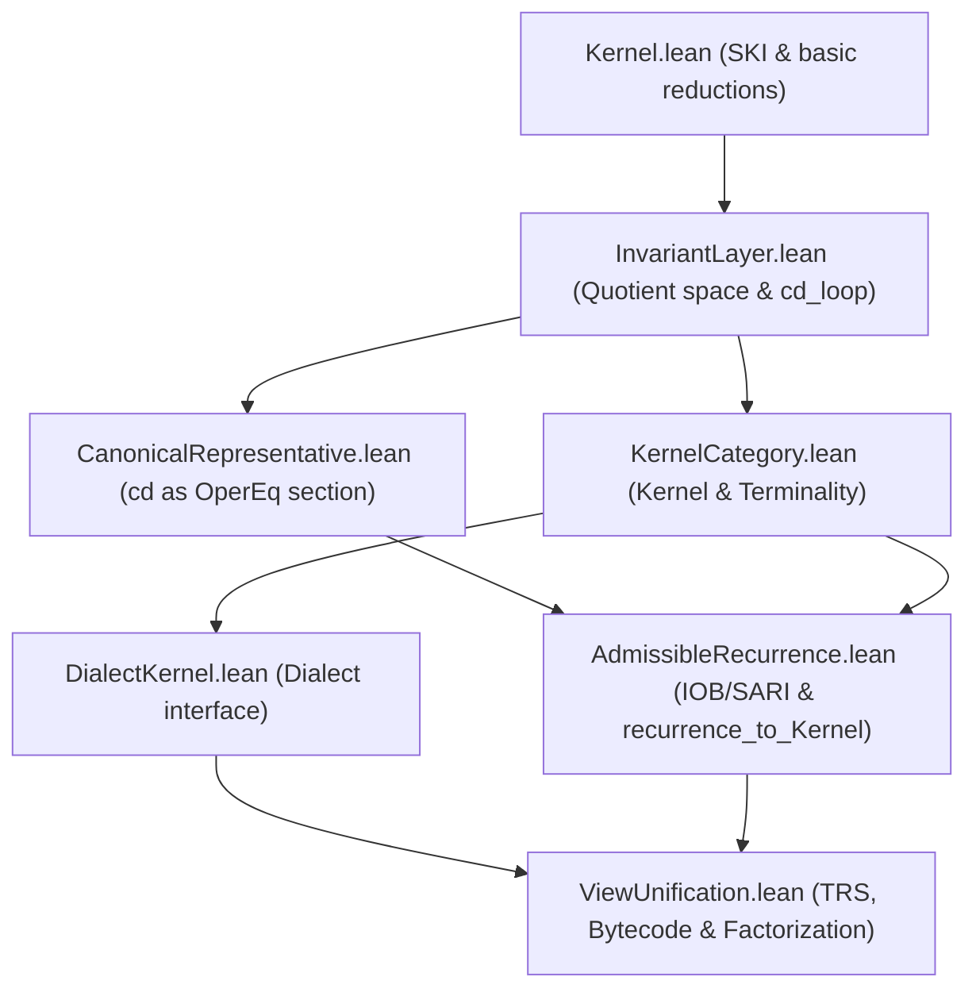

# ISAR Proof Status & Dependency Index

This document provides a comprehensive inventory of proof dependencies, first-principles derivations, and foundational definitions/axioms across the ISAR verified stack.

---

## Inventory: `sorry` / `axiom` / `noncomputable` (after fixes)

Build: `lake build ISAR` green. No `sorry` / `sorryAx` in `src/**/*.lean`. Full JGS BTA for all ISAR remains **open** (not claimed).

### Sorry

| Item | Status | Notes |
| :--- | :--- | :--- |
| *(none)* | **OK** | Comments only say “sorry-free”; no `sorry` tactics. |

### Axioms (classified)

| Location | Item | Status | Notes |
| :--- | :--- | :--- | :--- |
| `HFSet.lean` | `testBit_zero_number`, `testBit_shiftl` | **fixed → theorems** | Now `Nat.zero_testBit` / `testBit_two_pow` proofs. |
| `IotaView.lean` | `iota_encode_decode_canonical` | **fixed → removed** | Was a false-risk “NF stays in ι-image” claim. Dialect now observes `InvariantLayer` (computable `id` decode). |
| `HolonomicCompose.lean` | `exp_exp_not_holonomic` | **OK** | Named Stanley/Bell analytic fact; not in Mathlib. |
| `HFSetEncoding.lean` | `subToNat`/`natToSub`/`fromNat`/`layerToNat` (+ inverses) | **OK** | Modeling countable bijection bridges; not derived. |
| `QuantityKernel.lean` | `quantityToNat` / `natQuantity` (+ inverses) | **OK** | Same style bridge (Quantity has `String`/`Float`). |
| `TensorSemantics.lean` | `TensorSpace`, `ExtEq`, combinators, β-laws, `obs_*` | **OK** | Abstract denotational model. |
| `ISARApproximation.lean` | `ISAR_UAT`, limit/embedding/bijection axioms | **OK** | Analytic UAT / topological completion interface. |

### Noncomputable (classified)

| Location | Item | Status | Notes |
| :--- | :--- | :--- | :--- |
| `TRSView` / `BytecodeView` / `IotaView` dialects | Dialect defs | **fixed → computable** | OperEq-quotient observations (`Quotient.lift`); no `canonical_rep`. |
| `ViewUnification` | `TRS_`/`Bytecode_AdmissibleDialect`, `isomorphism_unification` | **fixed → computable** | Follow dialects. |
| `BasisCompleteness` | `term_signature`, `term_matrix` | **fixed → computable** | Were unnecessarily marked. |
| `InvariantLayer` | `nf_of_term`, `canonical_rep` | **OK (necessary)** | `Classical.choose` on `HasNF` / `Quotient.exists_rep`. Explicit `cd` path: `canonical_nf` / `cd_loop_fuel`. |
| `AdmissibleRecurrence` | `recurrence_to_Kernel` | **OK (necessary)** | Uses `canonical_rep` section. |
| `HFSetEncoding` / `HFSetSemantics` / `ZFCInterpretation` / `QuantityKernel` | encode/decode/kernels | **OK** | Via encoding axioms + `canonical_rep`. |
| `ViewUnification` | `encode_from_sig`, `eval_to_nf`, SN dialect bridge | **OK** | `Classical.choose` / WF recursion choice. |
| `Holonomic*.lean` | `noncomputable section` | **OK (necessary)** | Mathlib analysis / `ℝ` / C∞. |
| `ISARApproximation` | continuous maps / realizations | **OK (necessary)** | Topology on `ℝ`. |
| `TensorSemantics` | `denot`, quotients | **OK** | Built on axiomatic tensor carrier. |

**Necessity summary:** remaining `noncomputable` is Classical.choice / `exists_rep` for OperEq sections, Mathlib analysis, or axiom-backed bridges — not silent gaps.

---

## Vacuity audit (headline theorems)

Sorry-free compilation does **not** imply non-vacuous content. Checklist for main claims:

| Claim | Status | Notes |
| :--- | :--- | :--- |
| `IRed_confluence` / `isar_fragment_unique_normal_forms` | Substantive | Parallel reduction / complete development; not `rfl`. |
| `morphism_uniqueness` / `ISAR_Kernel_terminal` | Conditional | Unique morphisms into `ISAR_Kernel` **relative to the `Kernel` interface**. If that interface is too weak, the category collapses and everything looks terminal — schedule a false-variant (degenerate Kernel) as a regression test. Expected axioms today may include `propext` / `Classical.choice` via quotient infrastructure. |
| `futamura_first` (subst layer) | Substantive but narrow | Mix equation at the meta-level specializer; does not by itself give optimizing PE. |
| `futamura_second` / `futamura_third` (pre-PESetup) | Formulation-sensitive | Honest form needs object-level `specTerm` + `selfApp` + **nontriviality**; trivial specializers satisfy mix alone. |
| `futamura_second` / `futamura_third` (`PESetup`) | Substantive (conditional) | Mix instantiations. `TrivialPE`: mix/selfApp by `rfl`, `¬ Nontrivial`. `OptimizingPE`: identity/konstβ fragment folds + tagged residual; mix by size induction, `selfApp` by `rfl`, **`Nontrivial` proved** (`norm·konst`). Full JGS BTA for all ISAR remains open. |
| `recurrence_to_Kernel` | Bridge | No `Quotient.out` on the carrier quotient: lift decode → `InvariantLayer`, then `canonical_rep` / `cd_loop_fuel`. Unrestricted `canonical_rep_eq` is now a **theorem** (`nf_of_term` uses NF or `exists_rep`; never the false `norm` fallback). |
| `fixed_point` in SARI (`I ↔ no R-step`) | Often definitional | See §4; treat as modeling choice, not deep content. |
| HF encoding axioms in `HFSetEncoding` | Axiomatic bridges | Not derived; do not market as proved. |

Procedure for re-check after edits: `#print axioms morphism_uniqueness` (and peers) in a Lean session — reject `sorryAx`; expect `Classical.choice` / `propext` until fully constructive sections land.

**Literature posture:** Rutten–Aczel (coalgebras), Abramsky–Ong (applicative bisimilarity), Jones/Gomard/Sestoft (partial evaluation). No Wolfram / quine-substrate framing on the public surface; the quine whitepaper is withdrawn from the homepage.

---

## 0. Holonomic closure algebra (Python + Lean)

| Artifact | Notes |
| :--- | :--- |
| [`scratch/isar_holonomic_closure_algebra.py`](scratch/isar_holonomic_closure_algebra.py) | Exploratory SymPy kernel. Self-test: `python scratch/isar_holonomic_closure_algebra.py`. |
| [`docs/holonomic_closure_and_isar_session.md`](docs/holonomic_closure_and_isar_session.md) | Session record + Lean inventory (§12). |
| [`src/ISAR/Holonomic.lean`](src/ISAR/Holonomic.lean) | Certificate API. |
| [`src/ISAR/HolonomicClosure.lean`](src/ISAR/HolonomicClosure.lean) | Integral / product / sum closure theorems. |
| [`src/ISAR/HolonomicInstances.lean`](src/ISAR/HolonomicInstances.lean) | All Python self-test residual certificates (proved). |
| [`src/ISAR/HolonomicCompose.lean`](src/ISAR/HolonomicCompose.lean) | Composition refusal; sole analytic axiom `exp_exp_not_holonomic`. |

**Water-tight inventory:** every residual-zero claim from the Python self-test (exp, gaussian, product, sum `exp+gaussian`, Fresnel `sin(x²)`, mixed product `sin(x²)·gaussian`, double-integral shift, compose refuse) is a Lean theorem with no `sorry`. The only named axiom in the holonomic stack is `exp_exp_not_holonomic` (Stanley/Bell non-holonomicity of `exp∘exp`, not yet in Mathlib). Build: `lake build ISAR`.

---

## 1. Index of Proof Dependencies

The logical chain of verified Lean 4 files is structured as follows:

* **[Kernel.lean](https://github.com/Cypoe/ISAR-proofs/blob/master/src/ISAR/Kernel.lean)**:
  - Formulates SKI and ITerm (ISAR symbolic core).
  - Proves confluence (`IRed_confluence`) and unique normal forms (`isar_fragment_unique_normal_forms`) via parallel reduction / complete development.
* **[InvariantLayer.lean](https://github.com/Cypoe/ISAR-proofs/blob/master/src/ISAR/InvariantLayer.lean)**:
  - Constructs the quotient `InvariantLayer` modulo `OperEq`.
  - Defines the normalization loop `cd_loop_fuel`.
* **[KernelCategory.lean](https://github.com/Cypoe/ISAR-proofs/blob/master/src/ISAR/KernelCategory.lean)**:
  - Defines the category of semantic kernels (`Kernel` objects, `KernelHom` morphisms).
  - Proves the **ISAR Kernel Terminality Theorem** (`ISAR_Kernel_terminal`) showing all admissible views factor uniquely through `ISAR_Kernel`.
* **[DialectKernel.lean](https://github.com/Cypoe/ISAR-proofs/blob/master/src/ISAR/DialectKernel.lean)**:
  - Formalizes the abstract `Dialect` wrapper.
* **[AdmissibleRecurrence.lean](https://github.com/Cypoe/ISAR-proofs/blob/master/src/ISAR/AdmissibleRecurrence.lean)**:
  - Formalizes the presuppositional `IOB` triad and operational `AdmissibleSARI` quartet (constrained by confluence, fixed-point invariants, and pairing closure).
  - Proves the **Recurrence Lemma** (`recurrence_lemma`) mapping closed carrier quotients to the next scale and verifying that the quotient layer satisfies the constraints.
  - Proves the **Universal Mapping Theorem** (`recurrence_to_Kernel`) which translates the recurrence quotient space into the category-theoretic `Kernel` class.
* **[ViewUnification.lean](https://github.com/Cypoe/ISAR-proofs/blob/master/src/ISAR/ViewUnification.lean)**:
  - Unifies observational isomorphism and categorical kernel isomorphism (`isomorphism_unification`).
  - Proves the **Universal Factorization Theorem** (`universal_factorization_theorem`) across semantic views.

---

## 2. First-Principles Derivations & Design Decisions

The following structures and theorems are derived constructively from first-principles without adding new axioms:

1. **Admissible SARI Quartet**:
   - Derived as the operational roles emerging from the self-application of the presuppositional `IOB` triad.
   - Constrained by confluence, fixed-point identities, and substitution closure.
2. **Category of Admissible Carriers ($\mathbf{Adm}$)**:
   - Formulated as carrier spaces equipped with IOB whose dynamics are stable under the self-composition functor $F(C) \cong C$.
3. **The Recurrence Step**:
   - Proven in `recurrence_lemma` showing that quotienting by operational equality preserves IOB and yields a constrained `AdmissibleSARI` operational layer.
4. **Categorical Quotient Kernel (`recurrence_to_Kernel`)**:
   - Constructs a category-theoretic `Kernel` from the recurrence quotient by lifting
     `decode` into `InvariantLayer` (AC-free) and selecting an ISK representative via
     `canonical_rep` / complete development (`CanonicalRepresentative.lean`).
   - No longer uses `Quotient.out` on the carrier quotient.

### Architectural Decision: Modular Bridge vs. Monolithic Rebase
To unify the stack, we chose to maintain **independence** between the `KernelCategory` framework and `AdmCarrier`, utilizing `recurrence_to_Kernel` as a **bridge lemma**:
- *Why*: Forcing all category-theoretic semantic views (`Kernel`) to be derived from `AdmCarrier` quotients would impose severe proof obligations on simple views (e.g. HF sets, Stack VMs) that do not naturally use IOB structures.
- *Representatives*: Carrier decode lifts to `InvariantLayer` without choice; the OperEq section uses `cd` / `cd_loop_fuel` on the linear fragment (`canonical_nf`) and `canonical_rep` in general (`HasNF` choose, else class `exists_rep`). Unrestricted `canonical_rep_eq` is a theorem. Explicit `cd`-based theorems live in `CanonicalRepresentative.lean`.

---

## 3. Axioms, Primitive Definitions, and Assumptions

The verified stack relies on the following ground-truth definitions, which serve as the axiomatic baseline of the system:

1. **Substrate Reductions (`IStep`)**:
   - The transition rules for `normβ`, `konstβ`, `compβ`, and `sβ` in `Kernel.lean` are the axiomatic reductions of the substrate.
2. **Causal Compatibility (`O_compat` / `B_compat`)**:
   - The compatibility of the application (`O`) and pairing (`B`) operations with operational equivalence is assumed in the general `recurrence_lemma`.
3. **Observation Faithfulness (`sig_faithful_opereq` / `sig_surjective`)**:
   - The mapping of dialect observables to the tensor substrate via causal signatures (in `ConfluentSNSystem`) is assumed to be faithful and surjective for general realizability.
4. **Physical Interpretive Hypotheses**:
   - The correspondence between mathematical fixed points ($S/A$-stable carriers) and physical quantum/geometric systems remains an interpretive modeling choice, not a verified logic of the proof assistant.

---

## 4. Critical SARI Modeling Notes & Future Roadmap

During the current implementation cycle of `AdmissibleRecurrence.lean`, several critical modeling constraints and structural simplifications were identified:

1. **Statehood & Pairing Closure (`S := fun _ => True`)**:
   - Setting $S$ to the constant-True predicate makes the `pairing_closure` axiom ($\forall c_1 c_2, S(c_1) \to S(c_2) \to S(c_1)$) vacuous. It proves structural existence but does not yet perform real state-space discrimination or capture why only certain carriers satisfy physical admissibility.
2. **Adjacency Modeling ($A$ via $B$ vs. $O$)**:
   - Adjacency is currently wired as $A(q_1, q_2) \iff B(\text{out}(q_1)) \sim q_2$, tying adjacency to the unary bootstrap operator $B$ rather than the binary pairing application $O$. This is a deliberate modeling choice for bootstrap reachability, but diverges from the canonical view of adjacency as binary pairing relation closure.
3. **Fixed-Point Tautology ($I$ by Fiat)**:
   - Defining $I(q)$ explicitly as the absence of outgoing transitions makes the `fixed_point` equivalence proof a definitional tautology. It does not yet derive the invariants from the outer carrier self-composition functor $F(c) = c$.
4. **Roadmap to Monolithic Rebase**:
   - To make a full rebase of `KernelCategory` on `QuotientCarrier` mathematically meaningful, a future lemma must show that if a carrier $C$ satisfies the self-composition closure condition $F(C) \cong C$, the induced `AdmissibleSARI` on the quotient space inherits a non-trivial, derived state-space split ($S \subset C$) rather than the constant-True placeholder. Until then, `recurrence_to_Kernel` remains a valuable and modular bridge lemma.

