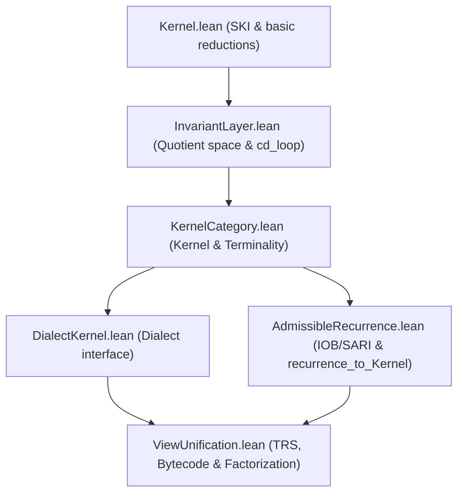

# ISAR Proof Status & Dependency Index

This document provides a comprehensive inventory of proof dependencies, first-principles derivations, and foundational definitions/axioms across the ISAR verified stack.

---

## 1. Index of Proof Dependencies

The logical chain of verified Lean 4 files is structured as follows:

* **[Kernel.lean](file:///C:/Users/fabi0/Documents/antigravity/joyful-lavoisier/src/ISAR/Kernel.lean)**:
  - Formulates SKI and ITerm (ISAR symbolic core).
  - Proves confluence (`IRed_confluence`) and unique normal forms (`isar_fragment_unique_normal_forms`) via parallel reduction / complete development.
* **[InvariantLayer.lean](file:///C:/Users/fabi0/Documents/antigravity/joyful-lavoisier/src/ISAR/InvariantLayer.lean)**:
  - Constructs the quotient `InvariantLayer` modulo `OperEq`.
  - Defines the normalization loop `cd_loop_fuel`.
* **[KernelCategory.lean](file:///C:/Users/fabi0/Documents/antigravity/joyful-lavoisier/src/ISAR/KernelCategory.lean)**:
  - Defines the category of semantic kernels (`Kernel` objects, `KernelHom` morphisms).
  - Proves the **ISAR Kernel Terminality Theorem** (`ISAR_Kernel_terminal`) showing all admissible views factor uniquely through `ISAR_Kernel`.
* **[DialectKernel.lean](file:///C:/Users/fabi0/Documents/antigravity/joyful-lavoisier/src/ISAR/DialectKernel.lean)**:
  - Formalizes the abstract `Dialect` wrapper.
* **[AdmissibleRecurrence.lean](file:///C:/Users/fabi0/Documents/antigravity/joyful-lavoisier/src/ISAR/AdmissibleRecurrence.lean)**:
  - Formalizes the presuppositional `IOB` triad and operational `AdmissibleSARI` quartet (constrained by confluence, fixed-point invariants, and pairing closure).
  - Proves the **Recurrence Lemma** (`recurrence_lemma`) mapping closed carrier quotients to the next scale and verifying that the quotient layer satisfies the constraints.
  - Proves the **Universal Mapping Theorem** (`recurrence_to_Kernel`) which translates the recurrence quotient space into the category-theoretic `Kernel` class.
* **[ViewUnification.lean](file:///C:/Users/fabi0/Documents/antigravity/joyful-lavoisier/src/ISAR/ViewUnification.lean)**:
  - Unifies observational isomorphism and categorical kernel isomorphism (`isomorphism_unification`).
  - Proves the **Universal Factorization Theorem** (`universal_factorization_theorem`) across semantic views.

---

## 2. First-Principles Derivations & Design Decisions

The following structures and theorems are derived constructively from first-principles without adding new axioms:

1. **Admissible SARI Quartet**:
   - Derived as the operational roles emerging from the self-application of the presuppositional `IOB` triad.
   - Constrained by confluence, fixed-point identities, and substitution closure.
2. **Category of Admissible Carriers ($\mathbf{Adm}$)**:
   - Formulated as carrier spaces equipped with IOB whose dynamics are stable under the self-composition functor $F(C) \cong C$.
3. **The Recurrence Step**:
   - Proven in `recurrence_lemma` showing that quotienting by operational equality preserves IOB and yields a constrained `AdmissibleSARI` operational layer.
4. **Categorical Quotient Kernel (`recurrence_to_Kernel`)**:
   - Constructs a category-theoretic `Kernel` directly from the recurrence quotient space by using the `Quotient.out` representative selection mapping.

### Architectural Decision: Modular Bridge vs. Monolithic Rebase
To unify the stack, we chose to maintain **independence** between the `KernelCategory` framework and `AdmCarrier`, utilizing `recurrence_to_Kernel` as a **bridge lemma**:
- *Why*: Forcing all category-theoretic semantic views (`Kernel`) to be derived from `AdmCarrier` quotients would impose severe proof obligations on simple views (e.g. HF sets, Stack VMs) that do not naturally use IOB structures.
- *Noncomputability*: The bridge maps quotient classes to concrete representatives using `Quotient.out`, rendering the mapping `noncomputable` due to reliance on the Axiom of Choice.

---

## 3. Axioms, Primitive Definitions, and Assumptions

The verified stack relies on the following ground-truth definitions, which serve as the axiomatic baseline of the system:

1. **Substrate Reductions (`IStep`)**:
   - The transition rules for `normβ`, `konstβ`, `compβ`, and `sβ` in `Kernel.lean` are the axiomatic reductions of the substrate.
2. **Causal Compatibility (`O_compat` / `B_compat`)**:
   - The compatibility of the application (`O`) and pairing (`B`) operations with operational equivalence is assumed in the general `recurrence_lemma`.
3. **Observation Faithfulness (`sig_faithful_opereq` / `sig_surjective`)**:
   - The mapping of dialect observables to the tensor substrate via causal signatures (in `ConfluentSNSystem`) is assumed to be faithful and surjective for general realizability.
4. **Physical Interpretive Hypotheses**:
   - The correspondence between mathematical fixed points ($S/A$-stable carriers) and physical quantum/geometric systems remains an interpretive modeling choice, not a verified logic of the proof assistant.

---

## 4. Critical SARI Modeling Notes & Future Roadmap

During the current implementation cycle of `AdmissibleRecurrence.lean`, several critical modeling constraints and structural simplifications were identified:

1. **Statehood & Pairing Closure (`S := fun _ => True`)**:
   - Setting $S$ to the constant-True predicate makes the `pairing_closure` axiom ($\forall c_1 c_2, S(c_1) \to S(c_2) \to S(c_1)$) vacuous. It proves structural existence but does not yet perform real state-space discrimination or capture why only certain carriers satisfy physical admissibility.
2. **Adjacency Modeling ($A$ via $B$ vs. $O$)**:
   - Adjacency is currently wired as $A(q_1, q_2) \iff B(\text{out}(q_1)) \sim q_2$, tying adjacency to the unary bootstrap operator $B$ rather than the binary pairing application $O$. This is a deliberate modeling choice for bootstrap reachability, but diverges from the canonical view of adjacency as binary pairing relation closure.
3. **Fixed-Point Tautology ($I$ by Fiat)**:
   - Defining $I(q)$ explicitly as the absence of outgoing transitions makes the `fixed_point` equivalence proof a definitional tautology. It does not yet derive the invariants from the outer carrier self-composition functor $F(c) = c$.
4. **Roadmap to Monolithic Rebase**:
   - To make a full rebase of `KernelCategory` on `QuotientCarrier` mathematically meaningful, a future lemma must show that if a carrier $C$ satisfies the self-composition closure condition $F(C) \cong C$, the induced `AdmissibleSARI` on the quotient space inherits a non-trivial, derived state-space split ($S \subset C$) rather than the constant-True placeholder. Until then, `recurrence_to_Kernel` remains a valuable and modular bridge lemma.

