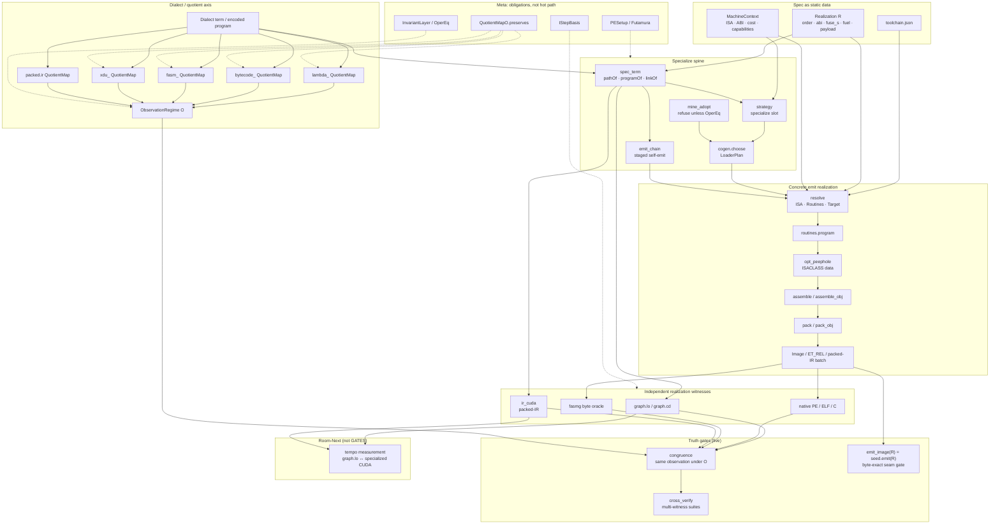

# ISAR Host — Stand Tip (~`99dc32d`, 2026-09-27)

**Repo:** `Cypoe/isar-proofs`  
**Quellen:** live `host/` + `seed/` + ADRs/GATES + Sep-2026 Commits.  
**Nicht als Tip-Wahrheit:** `STATUS.md` (2026-08, Lean-zentriert), generiertes `docs/CATALOG.md` (kann hinter `toolchain.json` liegen), älteres `docs/architecture_and_implementation.md`.

Room-Konsens (Fabian + snipe + tip-audit): Dialect × Realization/Target als **Produkt**; Gate-Wahrheit = Beobachtungskongruenz unter \(\mathcal O\).

---

## 0. These

Der Host ist ein **kataloggetriebener Realizer**, kein Compiler-Frontend:

> **Dialect as QuotientMap** × **static Realization / MachineContext**  
> → specialize (`emit_chain` / CoGen / HostPiece / image)  
> → run on **independent witnesses**  
> → **observe under \(\mathcal O\)**  
> → **congruence / cross_verify**

- Ein **Dialect** ist eine QuotientMap unter einem ObservationRegime \(\mathcal O\) (encode / decode / \(\sim_{\mathcal O}\)).
- Ein **Target/Witness** ist ein Realizer derselben beobachtbaren Operation — nicht „die Semantik“.
- **Byte-Identität** ist ein enges Seam-Gate (z. B. `emit_image(R) == seed.emit(R)`), nicht die allgemeine Wahrheit.
- Lean (`src/ISAR/**`) ist **Meta** (OperEq, QuotientMapO.preserves, PESetup, IStepBasis) — Orakel, nicht Hot Path.

---

## 1. Produktachsen (nicht flach legen)

| Achse | Was | Beispiele |
|-------|-----|-----------|
| **Dialect-QuotientMaps** | encode/decode + Beobachtungsrelation unter \(\mathcal O\) | `lambda_`, `bytecode_`, `fasm_`, `xdu_`, `packed.ir` |
| **Specialize-Spine** | alles Statische weg: Dialect, Realization, Targetdaten, Routinen, ABI, bekannte Payload → HostPiece / Image | `spec_term`, `strategy`, `cogen`, `emit_chain`, `mine_adopt` |
| **Target / Witnesses** | unabhängige Realisierungen | `graph.lo`/`graph.cd`, native PE/ELF/C, fasmg, `ir_cuda` (packed-IR) |
| **Gate-Wahrheit (live)** | Kongruenz der Beobachtungen | `congruence`, `cross_verify`; Seam: byte-exakt `emit_image`/`seed.emit` |
| **Room-Next (noch nicht GATES)** | Tempo-Messung | CUDA ↔ `graph.lo` — Protokoll §6; **keine** Catalog-Obligation |

**Leserichtung:** nicht Frontend → IR → ISA → executable, sondern Dialect × Realization → specialize → Witnesses → Observe under \(\mathcal O\).

**Futamura-2** sitzt auf der Spine: Spezialisierung derselben Emissionskette (staged Self-Emit als Termreduktionen), Seam = exportierte Terms / packed-IR-Batches — kein zweiter Compilerpfad.

---

## 2. Schichten & Module

| Schicht | Rolle | Module |
|---------|--------|--------|
| Meta (Lean) | Obligations, nicht Hot Path | `src/ISAR/**`, `Main.lean` |
| Catalog | Single declarations source | `host/toolchain.json`, `toolchain.py` (`load`/`resolve` → `NotRealized`) |
| Observation | Regime + QuotientMap | `observation_regime.py`, `quotient_map.py` |
| Dialects | Surface ↔ Term unter \(\mathcal O\) | `bytecode_dialect`, `lambda_dialect`, `xdu_dialect`, `fasm_dialect`, `tower` |
| Spec-as-term / PIR | G9 stages; `PIR\0` wire | `spec_term.py` (ADR-004/005) |
| Seed | Realization + `emit` Treiber | `seed/seed.py` (§0–§2 ohne host; §3 nur toolchain) |
| Strategy / CoGen | choose → LoaderPlan → emit → HostPiece; adopt nur bei OperEq | `strategy.py`, `cogen.py`, `mine_adopt.py`, `host_pieces.py` |
| ISA / Routines / Targets | Tabellen, Labelgraphen, Container | `isa_*.py`, `routines_*.py`, `target_*.py`, `enc_core.py` |
| Emit / Opt / CUDA | staged chain, peephole, PIR worker | `emit_chain.py`, `opt_peephole.py`, `ir_cuda.cu` |
| Verify | NF / stdout+rc / multi-witness | `reduce.py`, `graph_runtime.py`, `congruence.py`, `cross_verify.py`, `futamura_cube.py`, `battery.py` |

---

## 3. Paths & Emit-Kette

**Paths (ADR-004):**

- **`runtime`** — Term live reduziert (`operEq` NF): graph pieces + native reducers.
- **`native`** — Verhalten kompiliert ein (`stdout+rc`); heute vor allem `xdu.json`.

**Konkrete Emit-Realisierung:**

```
resolve(tc) → rts.program(R) → opt_peephole → isa.assemble[+_obj] → tgt.pack|pack_obj|c|fasmg
```

**Staged Self-Emit (G9 / `emit_chain`):**  
`resolveOf` → `programOf` → `linkOf` → `assembleOf`/`encodeOf` → `pack2Of` — je Basis-Term-NF; Python = Plumbing + Seam-Decode. Gate: `emit_image(R) == seed.emit(R)`.

**IR-Transport:** Token-Stream (`bc_compile`/`bc_decompile`) oder packed IR (`pack_ir` / `pack_ir_keyed`, `"PIR\0"` + roots + 9B nodes) → `make_ir_runner` / `ir_cuda`.

---

## 4. Witness-Matrix (Tip)

| Witness | Artifact | Checked |
|---------|----------|---------|
| `graph.lo` / `graph.cd` | in-process Graph | Basis-Orakel; cd = Runden ≠ Steps |
| `native.x86_64.pe` (+ fuse_s, .ir, .res) | PE64 | G0–G5; emit_chain byte-exact; residual graft; audit `rules=` |
| `x86_64.linux.lo` | ELF64 | Cross-ISA vs aarch64/riscv unter QEMU |
| `aarch64.linux.lo` | ELF (+ `.o`) + qemu-aarch64 | NF/steps/alloc/rc; audit parity |
| `riscv64.linux.lo` | ELF (+ `.o`) + qemu-riscv64 | dito (`687e385` — reducer in congruence set) |
| `native.c` | `.c` → cc | PE↔C, graph↔C |
| fasmg | Source → PE | Encoder-Orakel |
| `ir_cuda` | device worker | Funktionale PIR-Parität vs IR-Kernel; **nicht** in `toolchain.json` / GATES-Timing |

**Declared / refuses:** aarch64 win64/PE; UEFI; Mach-O; flat; macho routines.  
**QEMU-Wallzeiten** = TCG-Rauschen, kein Speed-Claim.

---

## 5. Ehrliche Lücken

1. **1993 polyvariant mix / Futamura P2–P3** — `futamura_cube` DECLARED; `MixStrategy` subst-only; `emit(R)` hand-written generating extension, nicht β-`specTerm`-Self-App.
2. **Retention / reclaim** — `reclaim: none` realisiert; arena/refcount declared; win64 monolithic assemble/pack >85GB-Klasse → decomposed + IR pool Workaround.
3. **CUDA** — Parallelität = Root; funktionale Kongruenz ja; **kein** benanntes GATES-Tempo-Obligation.
4. **Catalog drift** — `docs/CATALOG.md` hinter Tip möglich.
5. **Native-path coverage** — nur `xdu.json` heute.
6. **G9 native/cd deferrals** — exe throughput / arena retention.

---

## 6. Nächste Ziele (Room-Tempo)

| Prio | Ziel | Erfolgskriterium |
|------|------|------------------|
| **1** | Ehrliche Tempo-Messung **CUDA ↔ `graph.lo`** (+ spezialisierte Stages) | Gleiches Workload; Wall + Kernel; **DEEP / fehlendes H2D = Gate-Fail**, nicht „langsam“ |
| **2** | Optional: **Capability-Raum in Spec** | Nur soweit Specialize sonst blind |
| **3** | Catalog-Hygiene | `CATALOG.md` / GATES an Tip; `ir_cuda` ehrlich einordnen (Witness, kein Timing-Gate bis Protokoll steht) |
| later | Polyvariant mix / P2–P3 β-`specTerm`; reclaim; declared Targets (UEFI/macho/flat); native-path über xdu hinaus | siehe §5 |

---

## 7. Mermaid — Produktarchitektur (kanonisch)



## 8. Mermaid — Emit → Load → Run

```mermaid
sequenceDiagram
  participant Spec as toolchain.json / Realization
  participant Seed as seed.emit
  participant Opt as opt_peephole
  participant ISA as isa_*.assemble
  participant Tgt as target_*.pack
  participant Exe as PE/ELF/C/CUDA
  participant Obs as operEq / stdout+rc

  Spec->>Seed: resolve(tc) → isa,rts,tgt
  Seed->>Seed: rts.program(R)
  Seed->>Opt: optimize(prog, isa)
  Opt->>ISA: assemble(prog, symbols)
  ISA->>Tgt: text + labels
  Tgt->>Exe: image bytes
  Note over Exe: load OS/QEMU/cc/nvcc
  Exe->>Obs: stdin tokens|PIR → NF + steps/alloc/rules
  Obs-->>Spec: congruence vs graph.lo / PE / cross-ISA
```

---

## 9. Epistemik

| Claim | Confidence |
|-------|------------|
| Modulrollen, emit-Kette, PIR, CUDA-Vertrag, paths | Tip-Source |
| Cross-ISA QEMU, audit-Parity, peephole + residual bit-identity | Sep-27 Commit-Assertions (hier nicht neu gelaufen) |
| GATES live-Spalte | generiertes `GATES.md` / letzte Battery auf Tip |
| Tempo-Gate als Catalog-Obligation | **noch nicht** — Room-Protokoll (§6); funktional ja |

**Tip-Commits (Kontext):** `99dc32d` peephole+residual; `aa8d92d` audit `rules=` drei Linux-ISAs; `1666fbab` ET_REL `.o`; `687e385` riscv+QEMU in congruence set.
