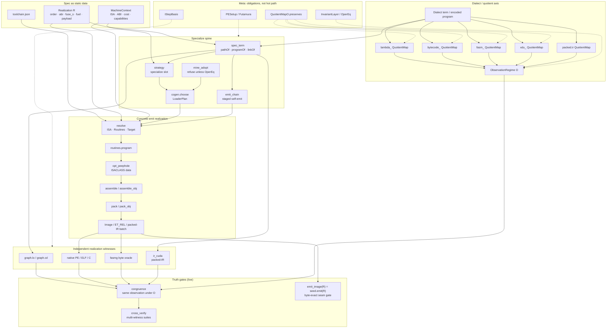
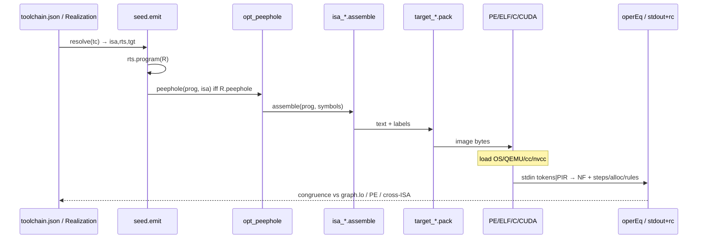

# ISAR Host — Stand Tip (~`99dc32d`, 2026-09-27)

**Repo:** `Cypoe/isar-proofs`  
**Quellen:** live `host/` + `seed/` + ADRs/GATES + Sep-2026 Commits.  
**Nicht als Tip-Wahrheit:** `STATUS.md` (2026-08, Lean-zentriert), generiertes `docs/CATALOG.md` (kann hinter `toolchain.json` liegen), älteres `docs/architecture_and_implementation.md`.

Room-Konsens (Fabian + snipe + tip-audit): Dialect × Realization/Target als **Produkt**; Gate-Wahrheit = Beobachtungskongruenz unter \(\mathcal O\).

---

## 0. These

Der Host ist ein **kataloggetriebener Realizer**, kein Compiler-Frontend:

> **Dialect as QuotientMap** × **static Realization / MachineContext**  
> → specialize (`emit_chain` / CoGen / HostPiece / image)  
> → run on **independent witnesses**  
> → **observe under \(\mathcal O\)**  
> → **congruence / cross_verify**

- Ein **Dialect** ist eine QuotientMap unter einem ObservationRegime \(\mathcal O\) (encode / decode / \(\sim_{\mathcal O}\)).
- Ein **Target/Witness** ist ein Realizer derselben beobachtbaren Operation — nicht „die Semantik“.
- **Byte-Identität** ist ein enges Seam-Gate (z. B. `emit_image(R) == seed.emit(R)`), nicht die allgemeine Wahrheit.
- Lean (`src/ISAR/**`) ist **Meta** (OperEq, QuotientMapO.preserves, PESetup, IStepBasis) — Orakel, nicht Hot Path.

---

## 1. Produktachsen (nicht flach legen)

| Achse | Was | Beispiele |
|-------|-----|-----------|
| **Dialect-QuotientMaps** | encode/decode + Beobachtungsrelation unter \(\mathcal O\) | `lambda_`, `bytecode_`, `fasm_`, `xdu_`, `packed.ir` |
| **Specialize-Spine** | alles Statische weg: Dialect, Realization, Targetdaten, Routinen, ABI, bekannte Payload → HostPiece / Image | `spec_term`, `strategy`, `cogen`, `emit_chain`, `mine_adopt` |
| **Target / Witnesses** | unabhängige Realisierungen | `graph.lo`/`graph.cd`, native PE/ELF/C, fasmg, `ir_cuda` (packed-IR) |
| **Gate-Wahrheit (live)** | Kongruenz der Beobachtungen | `congruence`, `cross_verify`; Seam: byte-exakt `emit_image`/`seed.emit` |

**Leserichtung:** nicht Frontend → IR → ISA → executable, sondern Dialect × Realization → specialize → Witnesses → Observe under \(\mathcal O\).

**Futamura-2** sitzt auf der Spine: Spezialisierung derselben Emissionskette (staged Self-Emit als Termreduktionen), Seam = exportierte Terms / packed-IR-Batches — kein zweiter Compilerpfad.

---

## 2. Schichten & Module

| Schicht | Rolle | Module |
|---------|--------|--------|
| Meta (Lean) | Obligations, nicht Hot Path | `src/ISAR/**`, `Main.lean` |
| Catalog | Single declarations source | `host/toolchain.json`, `toolchain.py` (`load`/`resolve` → `NotRealized`) |
| Observation | Regime + QuotientMap | `observation_regime.py`, `quotient_map.py` |
| Dialects | Surface ↔ Term unter \(\mathcal O\) | `bytecode_dialect`, `lambda_dialect`, `lisp_dialect` (s-expr → lambda IR, tagged values, corpus in `programs/lisp/`), `xdu_dialect`, `fasm_dialect`, `tower` |
| Spec-as-term / PIR | G9 stages; `PIR\0` wire | `spec_term.py` (ADR-004/005) |
| Seed | Realization + `emit` Treiber | `seed/seed.py` (§0–§2 ohne host; §3 nur toolchain) |
| Strategy / CoGen | choose → LoaderPlan → emit → HostPiece; adopt nur bei OperEq | `strategy.py`, `cogen.py`, `mine_adopt.py`, `host_pieces.py` |
| ISA / Routines / Targets | Tabellen, Labelgraphen, Container | `isa_*.py`, `routines_*.py`, `target_*.py`, `enc_core.py` |
| Emit / Opt / CUDA | staged chain, peephole, PIR worker | `emit_chain.py`, `opt_peephole.py`, `ir_cuda.cu` |
| Verify | NF / stdout+rc / multi-witness | `reduce.py`, `graph_runtime.py`, `congruence.py`, `cross_verify.py`, `futamura_cube.py`, `battery.py` |

---

## 3. Paths & Emit-Kette

**Paths (ADR-004):**

- **`runtime`** — Term live reduziert (`operEq` NF): graph pieces + native reducers.
- **`native`** — Verhalten kompiliert ein (`stdout+rc`); heute vor allem `xdu.json`.

**Konkrete Emit-Realisierung:**

```
resolve(tc) → rts.program(R) → [opt_peephole iff R.peephole] → isa.assemble[+_obj] → tgt.pack|pack_obj|c|fasmg
```

`R.peephole` ist Default **aus**: die staged Kette hat keine `peepholeOf`-Stufe und verweigert es (`NotRealized`). Sonst bräche der Seam `emit_image(R) == seed.emit(R)` (G10), wie es `99dc32d` passiert war.

**Staged Self-Emit (G9 / `emit_chain`):**  
`resolveOf` → `programOf` → `linkOf` → `assembleOf`/`encodeOf` → `pack2Of` — je Basis-Term-NF; Python = Plumbing + Seam-Decode. Gate: `emit_image(R) == seed.emit(R)`.

**IR-Transport:** Token-Stream (`bc_compile`/`bc_decompile`) oder packed IR (`pack_ir` / `pack_ir_keyed`, `"PIR\0"` + roots + 9B nodes) → `make_ir_runner` / `ir_cuda`.

### 3a. Kanonischer Packed-IR-Pfad (Handoff)

**Ein Vertrag, mehrere Realisierungen.** Das packed IR ist die einzige
semantische Transportgrenze; der Ausführungsmodus ist Realisierungs-/Scheduling-
Daten, nicht Sprachsemantik:

| Modus | Realisierung | Vertrag |
|-------|--------------|---------|
| single-thread | `native.x86_64.pe.ir` (bump, `reclaim=none`) | NF-Bytes + steps/alloc + rc |
| CPU-MT | `run.batch`-Workerpool, Root = Task, Ordnung stabil | identisch |
| GPU | `ir_cuda.cu`, ein Thread = ein Root | identisch (G17) |
| caps-reduziert | jeder Modus ohne Batch-/SIMD-ISA | identisch — Batching ist Scheduler-Wahl, keine ISA-Voraussetzung |

- **Kein SIMD-Postulat:** Batch-Ausführung ist eine Scheduler-Eigenschaft
  (Caps), kein ISA-Erweiterungszwang. Caps-reduzierte Ziele laufen 1:1
  über denselben PIR-Stream, nur sequentiell.
- **Dynamische Dispatch** eines Programms: Root-Batches sind die
  Dispatch-Einheit; dieselbe `.pir`-Blob kann je nach Cap/Workload an
  single / CPU-MT / GPU gehen — gemischte Modi innerhalb eines Programms
  sind nur die Vereinigung mehrerer Batches/Phasen.
- **Per-root reset:** Referenzmodell ist der native Kernel —
  `MEM_RESERVE` groß + Commit-on-touch + `MEM_DECOMMIT` je Root. CUDA
  trägt das mit `IR_CUDA_PER_ROOT=1` (private Slab-Cursor, Claims via
  `g_slabtop`) nach; G17-`+per_root`-Legs sind stat-gleich.
- **Dynamische Allokation, kein inhärentes Cap:** `ir_arena_bytes` /
  `IR_CUDA_HEAP_MB` sind VA-/Geräte-Schranken der Realisierung, nicht
  Sprachgrenzen. Nativ = großreserviert, lazy committed (Bend-Analog
  der ~8TB-VA). CUDA: `IR_CUDA_MANAGED=1` = UVM-Oversubscription
  (16GB-Arena auf 12GB-Karte verifiziert); Slab-Claims machen
  Root-Shares dynamisch statt `HEAP_MB/n_roots` statisch.

---

## 4. Witness-Matrix (Tip)

| Witness | Artifact | Checked |
|---------|----------|---------|
| `graph.lo` / `graph.cd` | in-process Graph | Basis-Orakel; cd = Runden ≠ Steps |
| `native.x86_64.pe` (+ fuse_s, .ir, .res) | PE64 | G0–G5; emit_chain byte-exact; residual graft; audit `rules=` |
| `x86_64.linux.lo` | ELF64 | Cross-ISA vs aarch64/riscv unter QEMU |
| `aarch64.linux.lo` | ELF (+ `.o`) + qemu-aarch64 | NF/steps/alloc/rc; audit parity |
| `riscv64.linux.lo` | ELF (+ `.o`) + qemu-riscv64 | dito (`687e385`). **Korrektur:** nicht im `congruence`-Set — Cross-ISA-Parität lief ad hoc (Shell), bis sie als Gate G12 registriert ist |
| `native.c` | `.c` → cc | PE↔C, graph↔C |
| fasmg | Source → PE | Encoder-Orakel |
| `ir_cuda` | device worker | Funktionale PIR-Parität vs IR-Kernel (G17: shared + `IR_CUDA_PER_ROOT` Slabs + `IR_CUDA_MANAGED` UVM); **nicht** in `toolchain.json` / GATES-Timing |

**Declared / refuses:** aarch64 win64/PE; UEFI; Mach-O; flat; macho routines.  
**QEMU-Wallzeiten** = TCG-Rauschen, kein Speed-Claim.

---

## 5. Ehrliche Lücken

1. **1993 polyvariant mix / Futamura P2–P3** — `futamura_cube` DECLARED; `MixStrategy` subst-only; `emit(R)` hand-written generating extension, nicht β-`specTerm`-Self-App.
2. **Retention / reclaim** — `reclaim: none` realisiert; arena/refcount declared; win64 monolithic assemble/pack >85GB-Klasse → decomposed + IR pool Workaround.
3. **CUDA** — Parallelität = Root; funktionale Kongruenz ja (inkl. `IR_CUDA_PER_ROOT` Slab-Allocator); **kein** benanntes GATES-Tempo-Obligation. CPU-MT-Worker sind Host-Pool, kein eigener Kernel.
4. **Catalog drift** — `docs/CATALOG.md` hinter Tip möglich.
5. **Native-path coverage** — nur `xdu.json` heute.
6. **G9 native/cd deferrals** — exe throughput / arena retention.

---

## 6. Jones gap / Was der Tip noch nicht ist

**Congruence**, Emissions-Kohärenz (Seam / `emit_chain`), **Cross-ISA-Parität** und **native-no-reducer** (Pfad `native` vs graph/runtime) sind etabliert oder explizit anvisiert — sie belegen **keine Jones-Optimalität** (partielle Evaluation als Speedup-Theorem).

Jones verlangt ein **explizites Kostenmodell**: Vergleich *specialized residual run* vs *direct subject run* unter **demselben** Dialect, **demselben** ObservationRegime \(\mathcal O\) und **demselben** Witness — nicht QEMU-Wallzeit, nicht CUDA↔graph-Benchmarks als Catalog-Claim, kein Tempo-Gate in `toolchain.json`.

**Strategy (Tip):** Identity + Mix-Subst — **nicht** 1993 polyvariant BTA (siehe §5.1).

### 6a. Theorem-Familien (nicht vermischen)

Vier unabhängige Familien. Jede Obligation in `toolchain.json` trägt `family` (welche Behauptung) und orthogonal `evidence` (welche Art Stütze). congruence ≠ seam ≠ cost ≠ selection.

| family | Behauptung | Stütze heute | Status |
|---|---|---|---|
| `quotient` | QuotientMap / Realisierung erhält Beobachtungen unter \(\mathcal O\) | `QuotientMapO.encode_sound`, `OperEq`, `operEqRegime`; Gates `congruence`, `cross_verify`, Cross-ISA | Lean-Aussagen + endliche Kongruenz-Gates |
| `staging` | Statische Maschinerie reduziert zu residualem HostPiece mit gleichem beobachtbarem Verhalten; Konstruktionswege stimmen überein | `PESetup`, `futamura_first/second/third`, `spec_term` G9*, `emit_chain`-Seam, Residual-Exe, `.o`↔exec | Lean (abstrakt) + Seam + Kongruenz |
| `cost` | Residual-Lauf kostet nicht mehr als Direktlauf, unter explizitem Tw,C | Lean `JonesOptimal` = **size-Jones (static)**: `pe_cost = term_size` auf abstraktem `PESetup`, bewiesen für `JonesIdPE` | Runtime-Tw,C **NotRealized**; Wall/QEMU nie als Jones-Ersatz |
| `selection` | Gewählter `LoaderPlan` minimiert eine angegebene Kostenfunktion über endlicher Kandidatenmenge | `choose(budget, MachineContext)` ist Strategie-Interface | **NotRealized** |

`evidence`-Arten: `congruence` (endliche Beobachtungsgleichheit unter deklariertem \(\mathcal O\)), `seam` (byte-exakte Gleichheit zweier Konstruktionswege), `cost` (Ungleichung unter explizitem `cost_model`), `selection` (Optimalität in deklarierter Kandidatenmenge), `lean` (Deklaration via `lake build`), `structural` (Quelltext-/Artefakteigenschaft ohne Ausführungsvergleich).

Lean-`JonesOptimal` wird bei der nächsten Berührung von `Futamura.lean` in eigenem Commit zu `SizeJonesOptimal` umbenannt.

---

## 7. Mermaid — Produktarchitektur (kanonisch)



## 8. Mermaid — Emit → Load → Run



---

## 9. Epistemik

| Claim | Confidence |
|-------|------------|
| Modulrollen, emit-Kette, PIR, CUDA-Vertrag, paths | Tip-Source |
| Cross-ISA QEMU, audit-Parity, peephole + residual bit-identity | Sep-27 Commit-Assertions (hier nicht neu gelaufen) |
| GATES live-Spalte | generiertes `GATES.md` / letzte Battery auf Tip |
| Jones-Optimalität / Tempo als Catalog-Obligation | **nein** — siehe §6 (Jones gap); funktionale CUDA/PIR-Parität ja |

**Tip-Commits (Kontext):** `99dc32d` peephole+residual; `aa8d92d` audit `rules=` drei Linux-ISAs; `1666fbab` ET_REL `.o`; `687e385` riscv+QEMU in congruence set.
