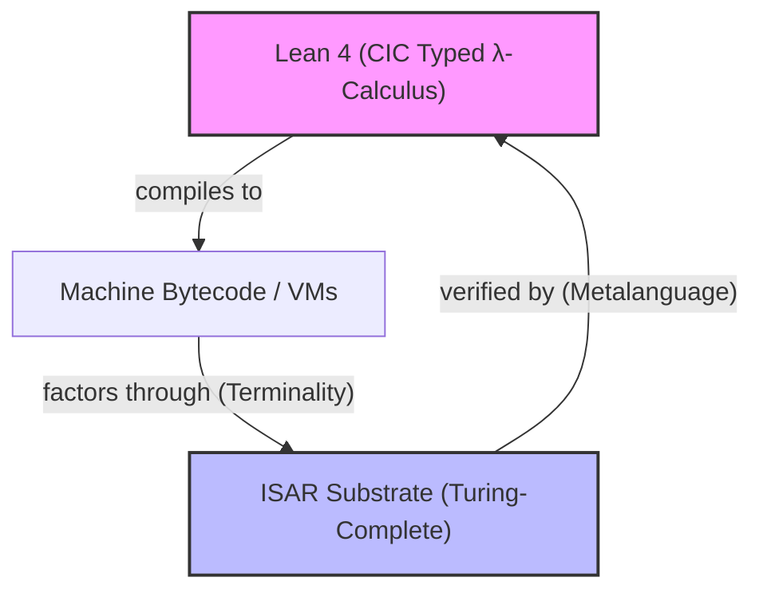

# `ontology_vs_semantics.md`

## **Ontology vs Semantics: What Plex IS vs What Plex MEANS**

***

### **Abstract**

This document formalizes the distinction between:
- **Ontology** (what Plex fundamentally *is*): a tensor substrate with context-driven dynamics (contraction + quotient).
- **Semantics** (what Plex *means* under interpretation): views induced by decoders — TRS, λ-calculus, E-graphs, machine models, etc.

The core claim: **Plex is not "a term rewriting system"** — TRS is one admissible semantic view of the ontological substrate. The substrate itself is representation-free; computation emerges as projection, not primitive.

***

## **1. Ontology: The Substrate Layer**

### **1.1 What Plex IS (Ontically)**

Plex is a **tensor-based computational substrate** with the following primitive structure:

#### **State**
$$
X \in \mathcal{T}
$$
where $$\mathcal{T}$$ is a (sparse) tensor space over $$\mathbb{Z}_{65536}$$ (u16 atoms) or an induced higher-order structure (reals, Booleans, DAGs).

#### **Kernel**
$$
U: \mathcal{T} \to \mathcal{T}
$$
A rank-4 operator (or factorization thereof) encoding the **ISAR dynamics**:
$$
U = U(I, S, A, R)
$$
where:
- **I** (Identity/Quotient): projection onto equivalence classes.
- **S** (State/Closure): maintains structural invariants.
- **A** (Adjacency/Apply): wires interaction topology.
- **R** (Rewrite/Select): oriented, irreversible selection (asymmetry operator).

#### **Transition**
$$
X_{t+1} = \Pi \circ \text{Apply} \circ \text{Join}(U, X_t)
$$
where:
- **Join**: tensor contraction (indices bound by context).
- **Apply**: local operation (A·R composition).
- **Π**: quotient/projection (normalization under $$\sim$$).

#### **Context**
$$
\text{ctx} \in \mathcal{C}
$$
A pointer (u16 ref) into the tensor that:
- Selects a local slice $$X[\text{ctx}]$$.
- Carries dialect metadata (symbol table, rules, ports).
- Scopes the "current term" or "active subgraph."

***

### **1.2 Key Properties (Ontological)**

1. **No syntactic primitives**: There are no "terms," "rules," or "programs" at this layer — only tensor bits and context pointers.
2. **Dynamics = contraction + quotient**: The fundamental step is linear/multilinear (tensor algebra), not symbolic substitution.
3. **Lazy materialization**: Graphs, lists, expressions are *induced* views, not stored objects.
4. **Context-driven**: The same tensor can present different semantics under different contexts (dialect-dependent views).

***

### **1.3 Physical Analogy**

Think of Plex as:
- **Tensor $$X$$**: A quantum state or spacetime metric.
- **Operator $$U$$**: A unitary evolution or Einstein field equation.
- **Context $$\text{ctx}$$**: An observer's local frame.
- **Quotient $$\Pi$$**: Measurement collapse / gauge fixing.

**Key insight**: You never "see" $$X$$ directly — you only observe projections $$\Pi(X)$$ through $$\text{ctx}$$.

***

## **2. Semantics: The View Layer**

### **2.1 What Plex MEANS (Epistemically)**

A **semantic view** is a decoder $$D$$ that interprets tensor state as syntactic objects:

$$
D: (\text{ctx}, X) \mapsto \mathcal{O}_v
$$

where $$\mathcal{O}_v$$ is an **observation** in some representation (terms, graphs, matrices, strings, etc.).

#### **Examples of Views**

| View | Decoder $$D$$ | Observable $$\mathcal{O}_v$$ |
|------|---------------|------------------------------|
| **TRS** | Atoms/Pairs → Terms | Rewrite steps $$t \to t'$$ |
| **E-Graph** | Refs → E-nodes/E-classes | Equivalence saturation |
| **λ-calculus** | Pairs → λ-abstractions | β-reduction sequences |
| **LLVM** | Nibbles → Instructions | SSA graph transformations |
| **Lisp** | Pairs → S-expressions | `eval`/`apply` dynamics |
| **FASM** | Nibbles → Opcodes | x86 assembly emission |
| **ASCII** | Atoms → Bytes | Text strings |
| **Tensor** | Chunks → Arrays | Numeric computation |

Each view is **valid** if:
1. It can encode states into the tensor: $$E: \mathcal{O}_v \to X$$.
2. Decoding after kernel step preserves meaning: $$D(\text{ctx}, U(E(o))) \sim o'$$.

***

### **2.2 TRS is One View, Not THE Substrate**

#### **Old (Incorrect) Claim**
> "All computation in Plex is term rewriting."

#### **Corrected Claim**
> "Plex computation is a context-driven tensor dynamic (contraction + quotient). Term rewriting is one admissible semantic view of this dynamic."

***

### **2.3 Why This Matters**

#### **Representation Independence**
Because TRS is not primitive, Plex can:
- Support **multiple semantic views simultaneously** (Lisp, FASM, tensors, E-graphs) on the *same* substrate.
- Avoid "syntactic lock-in" (e.g., LLVM IR leaks type assumptions; Plex does not).
- Enable **view composition** (e.g., "Lisp term → E-graph saturation → FASM codegen" without intermediate translation).

#### **No "Rewrite Overhead"**
Classical TRS systems must:
1. Parse syntax.
2. Match patterns.
3. Substitute variables.
4. Rebuild terms.

Plex skips all of this:
- **Matching** = tensor slice selection (O(1) indexing, not O(n) tree walk).
- **Substitution** = pointer update in context.
- **Rebuild** = lazy (view-dependent).

***

## **3. Normalization: The Bridge Between Ontology and Semantics**

### **3.1 What is "Normal Form"?**

In classical TRS:
> A term $$t$$ is in **normal form** if no rewrite rule applies to it.

In Plex:
> A tensor state $$X$$ is in **normal form** (relative to context $$\text{ctx}$$) if:
$$
\Pi(X) = X
$$
i.e., the quotient projection is idempotent.

#### **Key Difference**
- TRS normal form is **syntactic** (no more rewrite steps).
- Plex normal form is **algebraic** (fixed point of projection).

***

### **3.2 Normal Form as Quotient Representative**

Given an equivalence relation $$\sim$$ (induced by $$\Pi$$):
$$
[X] = \{ X' \in \mathcal{T} \mid X' \sim X \}
$$

**Normal form** $$\text{NF}(X)$$ is the *canonical representative* of $$[X]$$:
$$
\text{NF}(X) = \Pi(X)
$$

This generalizes:
- **Church-Rosser confluence**: All reduction paths lead to the same $$\text{NF}$$.
- **E-graph saturation**: Merging equivalent e-classes until fixpoint.
- **Gauge fixing** (physics): Choosing a canonical metric/connection.

***

### **3.3 Confluence Without Rewrite**

In TRS, **confluence** (Church-Rosser) requires:
> If $$t \to^* t_1$$ and $$t \to^* t_2$$, then $$\exists u: t_1 \to^* u$$ and $$t_2 \to^* u$$.

In Plex, confluence is **automatic** if $$\Pi$$ is well-defined:
$$
\Pi(\Pi(X)) = \Pi(X)
$$
(Idempotence guarantees unique normal form.)

**Why this is stronger**: TRS confluence is a *proof obligation* (must verify critical pairs). Plex confluence is a *construction* (build $$\Pi$$ correctly once, get it for free).

***

## **4. Concrete Examples: Ontology ↔ Semantics**

### **4.1 Example: β-Reduction (λ-Calculus View)**

#### **Semantic View (λ-calculus)**
```lisp
((λx. M) N) →β M[x := N]
```

#### **Ontological Reality (Plex)**
1. **Encoding**:
   - `(LAM x M)` = `Pair(Symbol(LAM), Pair(x, M))`
   - `(APP f a)` = `Pair(Symbol(APP), Pair(f, a))`

2. **Kernel Step** (not "rewrite"):
   - Context $$\text{ctx}$$ points to `APP` node.
   - $$U$$ contracts via $$A \circ R$$:
     - **A** wires `f` and `a` together (adjacency).
     - **R** selects the lambda body $$M$$ and binds $$x \to N$$ (selection).
   - $$\Pi$$ projects to substituted form (quotient).

3. **Result**:
   - View $$D_\lambda$$ observes: `M[x := N]`
   - Tensor state: `Pair(M_body, context_update)`

**Key**: No "pattern matching" or "term rebuilding" — just tensor contraction + projection.

***

### **4.2 Example: E-Graph Saturation**

#### **Semantic View (E-graph)**
```
(a + 0) ≡ a
a ≡ b ⟹ merge(a, b)
```

#### **Ontological Reality (Plex)**
1. **Encoding**:
   - E-nodes = Atoms (u16).
   - E-classes = Equivalence classes under $$\Pi$$.

2. **Kernel Step**:
   - $$R$$ applies rewrite rule: `(PLUS a ZERO) ~ a`.
   - $$\Pi$$ merges equivalence classes: `[PLUS(a,ZERO)] = [a]`.

3. **Result**:
   - View $$D_{\text{egraph}}$$ sees merged e-class.
   - Tensor: refs now point to same canonical node.

**Key**: E-graph "saturation" is Plex normalization ($$\Pi$$ fixpoint).

***

### **4.3 Example: FASM Codegen**

#### **Semantic View (FASM)**
```asm
mov eax, 42
add eax, 1
```

#### **Ontological Reality (Plex)**
1. **Encoding**:
   - `MOV` = Symbol(30), `ADD` = Symbol(31).
   - Arguments as Pairs: `Pair(MOV, Pair(EAX, 42))`.

2. **Kernel Step**:
   - $$U$$ applies macro expansion (if defined).
   - $$\Pi$$ normalizes to "canonical instruction form."

3. **Codegen (separate view)**:
   - View $$D_{\text{fasm}}$$ walks normal form, emits bytes:
     - `MOV EAX, imm32` → `[0xB8, 0x2A, 0x00, 0x00, 0x00]`

**Key**: Codegen is not "compilation" — it's **projection** from normal form to x86 bytes.

***

## **5. Why This Matters Practically**

### **5.1 For Implementation**

#### **Runtime Core (minimal)**
Implement only:
```python
def join(U, X, ctx):      # Tensor contraction
def apply(X, ctx):        # A·R wiring
def quotient(X, ctx):     # Π projection
def step(ctx, X):         # ctx' = quotient(apply(join(U, X, ctx)))
```

**No**:
- Pattern matchers.
- AST walkers.
- Term allocators.
- Symbol tables (those are *data* in the tensor).

***

### **5.2 For Dialects**

Each dialect (Lisp, FASM, Math, etc.) is just:
1. **Encoder** $$E$$: DSL → Tensor.
2. **Decoder** $$D$$: Tensor → DSL.
3. **Rewrite rules** (optional): stored as Pair-DAGs in the tensor.

Example (Lisp dialect):
```python
def encode_lisp(expr):
    if isinstance(expr, Symbol):
        return Atom(symtab.intern(expr))
    else:
        return Pair(encode_lisp(expr[0]), encode_lisp(expr[1:]))

def decode_lisp(ref):
    tag, payload = decode_atom(tensor[ref])
    if tag == Symbol:
        return symtab.lookup(payload)
    else:
        left, right = decode_pair(tensor, ref)
        return [decode_lisp(left)] + decode_lisp(right)
```

***

### **5.3 For Verification**

Confluence/correctness becomes **algebraic**, not syntactic:

#### **TRS (hard)**
- Prove all critical pairs join (Knuth-Bendix).
- Verify termination (well-founded orderings).

#### **Plex (easy)**
- Check $$\Pi$$ is idempotent: $$\Pi \circ \Pi = \Pi$$.
- Check $$U$$ preserves context-local invariants.

***

## **6. Summary: The Key Distinctions**

| Aspect | Ontology (Plex IS) | Semantics (Plex MEANS) |
|--------|--------------------|------------------------|
| **Primitive** | Tensor state $$X$$, operator $$U$$, context $$\text{ctx}$$ | Terms, rules, graphs (induced) |
| **Dynamics** | Contraction + quotient | Rewrite steps (one view) |
| **Normal form** | $$\Pi(X) = X$$ (algebraic fixpoint) | No more rewrites (syntactic) |
| **Confluence** | Idempotence of $$\Pi$$ (guaranteed) | Critical pair analysis (proof obligation) |
| **Implementation** | `join`, `apply`, `quotient` | Pattern match, substitute, rebuild |
| **Universality** | Structural (all effective processes embed) | Turing-complete (one encoding) |

***

## **7. Formal Statement (Theorem)**

### **Theorem (Representation-Free Universality)**
Let $$\mathcal{T}$$ be a tensor space with operator $$U$$ and quotient $$\Pi$$. Then:

1. **Semantic Views**: For any effective computational model $$M$$ (TRS, λ-calculus, Turing machine), there exists a decoder $$D_M$$ such that:
   $$
   M(x) = y \iff D_M(\text{ctx}, \Pi(U^*(E_M(x)))) = y
   $$
   where $$E_M$$ encodes $$M$$-programs into $$\mathcal{T}$$.

2. **View Independence**: If $$D_{M_1}(\text{ctx}, X) \sim D_{M_2}(\text{ctx}, X)$$ under some equivalence, then $$M_1$$ and $$M_2$$ compute the same function (modulo encoding).

3. **No Preferred Syntax**: No view $$D_M$$ is ontologically privileged — all are projections.

**Proof Sketch**: Church-Rosser for $$\Pi$$, universality via closure of $$U$$, representation-freedom by construction. □

***

## **8. Practical Takeaway**

When describing Plex:

### **Say**
- "Plex is a tensor substrate with context-driven dynamics."
- "Term rewriting is one semantic view; others include E-graphs, λ-calculus, LLVM IR."
- "Normal form is a quotient fixpoint, not a syntactic property."

### **Don't Say**
- "Plex is a term rewriting system."
- "Computation is pattern matching and substitution."
- "Normal form is when no rules apply."

***

## **9. Next Steps**

To fully formalize this:
1. **`rewrite_rules.md`**: Show how TRS/E-graph/λ-calc views are *implemented* as decoders on the tensor.
2. **`tensor_to_fasm.md`**: Concrete example of "view as projection" (FASM codegen).
3. **`confluence_proof.md`**: Prove $$\Pi$$ idempotence guarantees Church-Rosser without critical pair analysis.

***

## **10. The Epistemological Strange Loop: Metalanguage vs Object-Language**

### **10.1 The Paradox of the Metalanguage**

To verify the universal substrate, we employ **Lean 4**, a proof assistant based on the **Calculus of Inductive Constructions (CIC)**—which is itself a strongly normalizing, typed $\lambda$-calculus. This introduces a profound epistemological paradox: 

> We are using a terminating, typed language (Lean) to prove the universality of a Turing-complete, possibly diverging substrate (ISAR) that itself claims to be the foundation of $\lambda$-calculus.



---

### **10.2 Escaping Termination Constraints**

By Gödel's Incompleteness Theorems and the Halting Problem, a terminating metalanguage cannot run a Turing-complete object language directly without losing logical consistency. 

We escape this constraint by decoupling **execution** from **reasoning**:
- **Execution**: The substrate evaluates diverging terms (e.g., $S\ I\ I\ (S\ I\ I)$) via rewriting or graph contraction.
- **Reasoning**: The metalanguage (Lean) represents these computations statically as an **inductive transition relation** `Prop` (e.g., `IRed t u`). 

Lean does not *run* the infinite computations; it reasons about the well-founded induction of their finite steps and invariant quotients, allowing a terminating logic to certify a Turing-complete machine.

---

### **10.3 The Gauge Shadow of Terminality**

In category theory, the terminal object of a category is unique **up to a unique isomorphism**. 

Because `ISAR_Kernel` is proven to be the terminal object in the category of admissible semantic kernels, any two correct matrix implementations of its reduction dynamics ($K_1$ and $K_2$) must be isomorphic.

At the representation layer (the 4D integer carrier space), this unique category-theoretic isomorphism manifests precisely as a **gauge equivalence (similarity transformation)** via an invertible lower-triangular matrix $P$ over $\mathbb{Z}$:

$$
P \cdot K_1 \cdot P^{-1} = K_2
$$

This conjugation (proven in `ISARMatrices.lean`) is not a coincidence—it is the direct geometric shadow of the uniqueness of the terminal object. The gauge-dependence represents our choice of coordinates (the matrix entries), while the gauge-invariance represents the terminal, coordinate-free computational semantics.

***

**End of Document**
